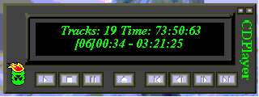



## A CDPlayer

### Description

A simple CD player, using winmm.dll
 
### More Info
 

             |
---                |---
**Submitted On**   |2000-12-30 22:26:20
**By**             |[Wijit Prajumsook](https://github.com/Planet-Source-Code/PSCIndex/blob/master/ByAuthor/wijit-prajumsook.md)
**Level**          |Intermediate
**User Rating**    |3.8 (15 globes from 4 users)
**Compatibility**  |VB 6\.0
**Category**       |[Sound/MP3](https://github.com/Planet-Source-Code/PSCIndex/blob/master/ByCategory/sound-mp3__1-45.md)
**World**          |[Visual Basic](https://github.com/Planet-Source-Code/PSCIndex/blob/master/ByWorld/visual-basic.md)
**Archive File**   |[CODE\_UPLOAD1316412302000\.zip](https://github.com/Planet-Source-Code/wijit-prajumsook-a-cdplayer__1-13946/archive/master.zip)

